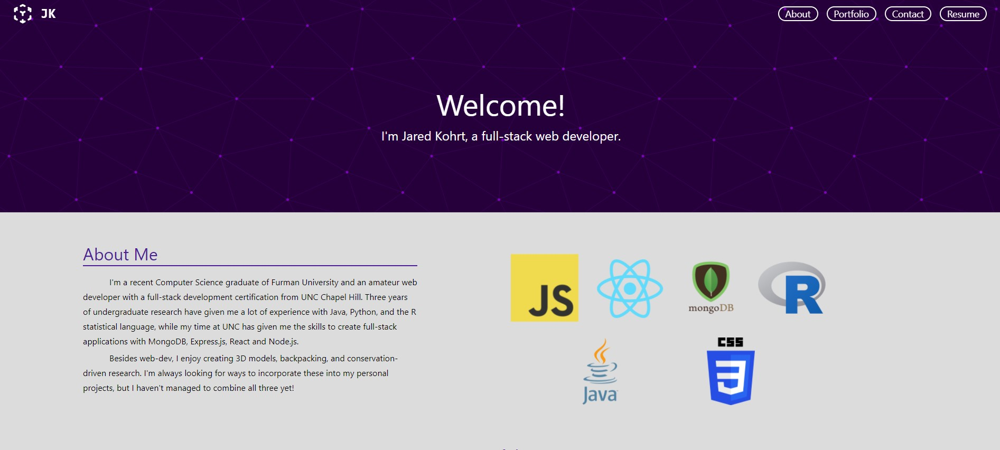

# React Portfolio

## Description

A portfolio page created with React and vanilla css.

## Contents

- [Installation](#installation)
- [Usage](#usage)
- [How to Contribute](#how-to-contribute)
- [Credits](#credits)
- [License](#license)

## Usage & Installation

No installation is necessary to visit the page; it's available through github pages here: https://jkohrt7.github.io/Test-Portfolio_V2/

If you're interested in downloading the project, you'll need

- [Node.js] (https://nodejs.org/en/)
- [React.js] (https://reactjs.org/)

Node.js can be install via their website. React, along with all other required dependencies, can be installed by navigating to the root folder of the project in a command line interface and running the command `npm i`.

## Questions

If you have any questions about using or contibuting to the project, you can contact me via email or though github:

- Email: jkohrt7@gmail.com
- Github: [@jkohrt](https://github.com/jkohrt)

## License

[MIT](https://opensource.org/licenses/MIT)
